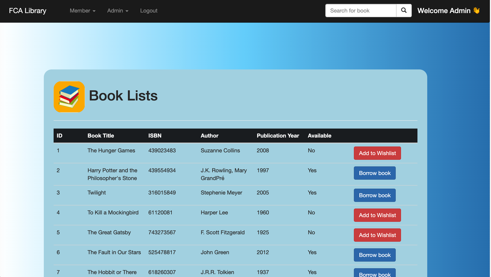
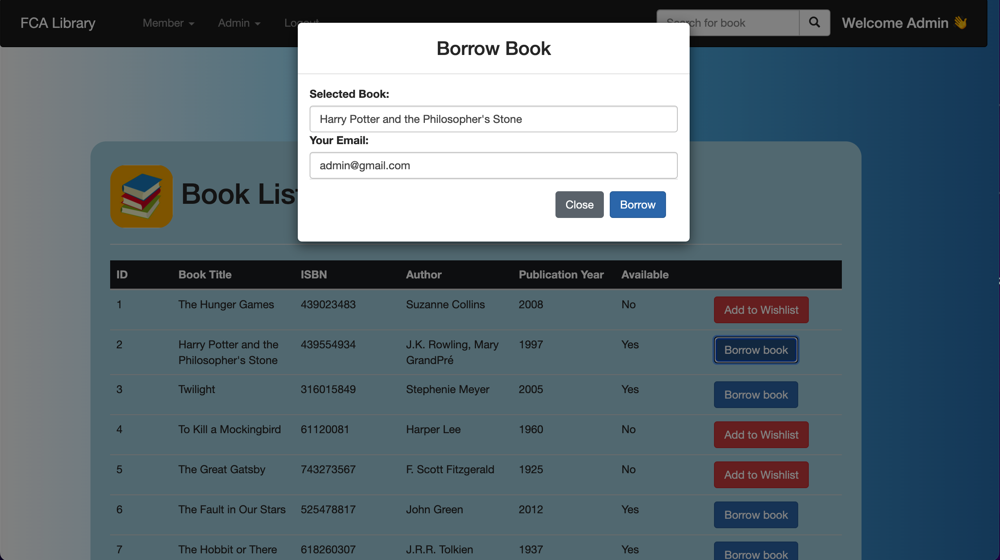
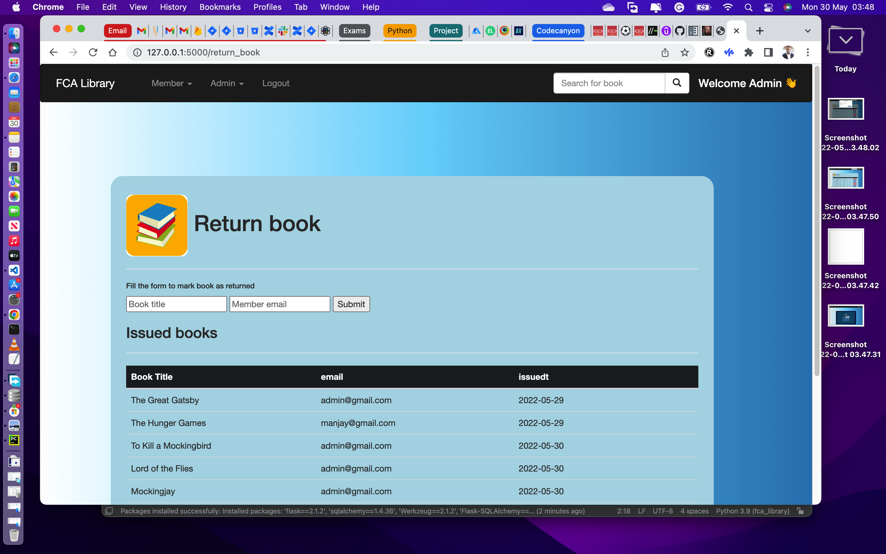
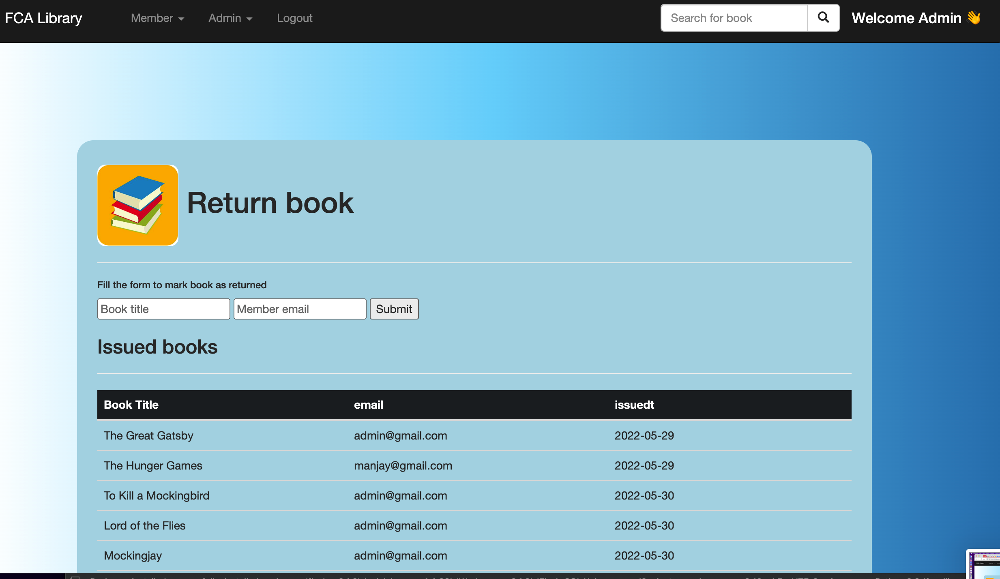

# FCA Library Mgt System

Python Flask application for library management system features like:

1. User and admin management
2. Manage books and members additions
3. New user can register to use the portal

Requirements:

1. Python 3.8 or up
2. sqllite3
3. flask
4. SqlAlchemy

Installation:

1. source venv/bin/activate
2. pip install -r requirements.txt

Getting Started:

1. cd mylibrary
2. python3 main.py
3. go to http://127.0.0.1:5000/ in your browser
4.

Default admin credentials:

1. email: admin@gmail.com
2. password: admin

Sample screenshot:
1. Admin options: 
To access admin portal login using provided default admin credentials

